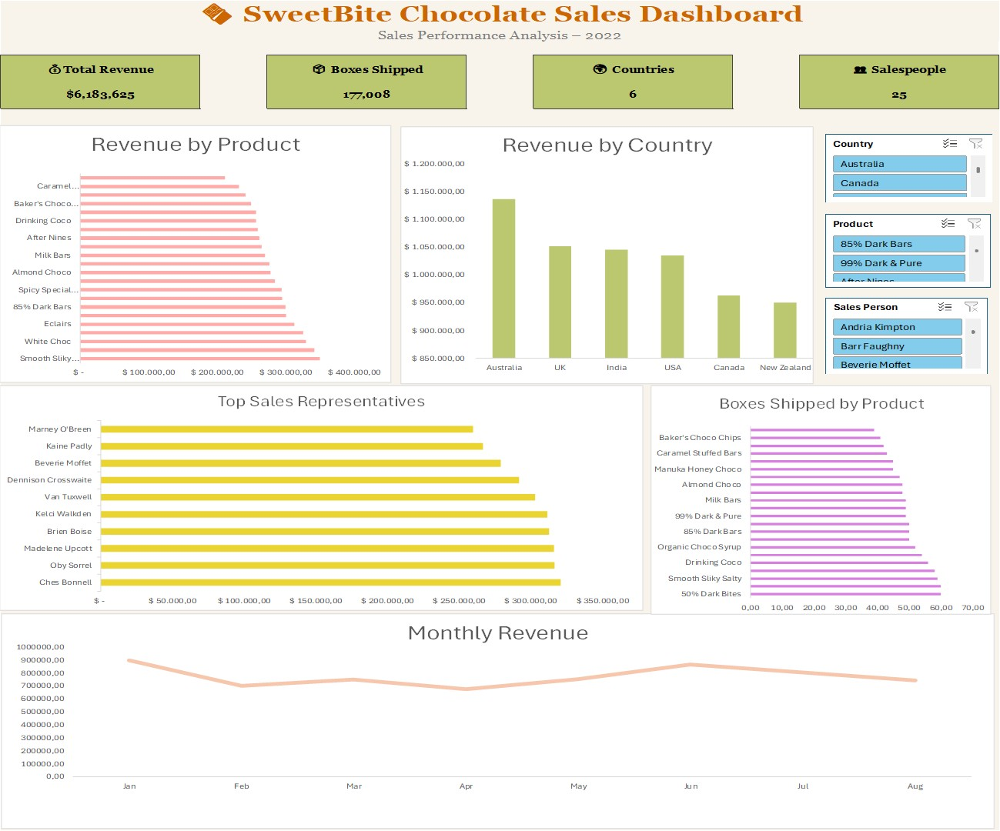

# 🍫 SweetBite Chocolate Sales Dashboard (Microsoft Excel)

An interactive Excel dashboard designed to analyze chocolate sales performance across multiple countries, products, and sales representatives. This project demonstrates data cleaning, data analysis, and dashboard design using Microsoft Excel, Pivot Tables, Pivot Charts, Power Query, and Slicers.

---

## 📊 Dashboard Preview

<p align="center">
  
</p>

---

## 📌 Project Overview

This dashboard provides an interactive overview of chocolate sales performance during 2022. Users can filter the data dynamically using slicers to explore sales by country, product, and sales representative.

The dashboard was built entirely in Microsoft Excel and focuses on transforming raw sales data into actionable business insights.

---

## 🎯 Business Objectives

- Analyze total sales revenue.
- Monitor boxes shipped across products.
- Compare sales performance by country.
- Identify top-performing sales representatives.
- Track monthly revenue trends.
- Create an interactive dashboard for business users.

---

## 📂 Dataset

The dataset contains over **1,000 chocolate sales transactions** with the following fields:

- Sales Person
- Country
- Product
- Date
- Amount
- Boxes Shipped

---

## 🛠️ Tools & Features Used

- Microsoft Excel
- Power Query
- Pivot Tables
- Pivot Charts
- Slicers
- Data Cleaning
- Interactive Dashboard Design

---

## 📈 Dashboard KPIs

The dashboard includes the following key performance indicators:

- 💰 Total Revenue
- 📦 Total Boxes Shipped
- 🌍 Number of Countries
- 👥 Number of Sales Representatives

---

## 📊 Dashboard Visualizations

- Revenue by Product
- Revenue by Country
- Top Sales Representatives
- Boxes Shipped by Product
- Monthly Revenue Trend

---

## 💡 Key Business Insights

- Australia generated the highest total revenue among all countries.
- Revenue remained relatively stable throughout the analyzed months.
- A small number of chocolate products contributed significantly to total sales.
- Sales performance varied considerably across representatives.
- Interactive slicers allow users to analyze sales by country, product, and salesperson instantly.

---

## 📁 Repository Structure

```text
excel-chocolate-sales-dashboard/
│
├── Chocolate Sales.xlsx
│
├── dashboard.jpg
│
└──README.md

```

---

## 🚀 Skills Demonstrated

- Data Cleaning with Power Query
- Data Transformation
- Pivot Table Analysis
- Dashboard Design
- Business Intelligence Reporting
- Interactive Data Visualization
- Excel Data Analysis

---

## 👩‍💻 Author

**Anna María Román Ríos**

- 💼 Aspiring Data Analyst
- 🌐 LinkedIn: *(www.linkedin.com/in/anna-román-8669a4191)*
- 💻 GitHub: https://github.com/romanna-data
